# DropInSlovenia — Dokumentacija programske rešitve

> - Vsi diagrami so napisani v **Mermaid** DSL in se na GitHubu izrišejo samodejno.
> - Ganttov diagram je izdelan iz **dejanskega Jira exporta** (projekt SCRUM, 141 zadev);
>   naloge so strnjene po epicih v fazni plan.
> - Razredni diagrami so izpeljani **neposredno iz izvorne kode** — polja, metode in
>   relacije ustrezajo dejanskemu stanju repozitorijev.

---

## Kazalo

1. [Prva stran](#1-prva-stran)
2. [Primeri uporabe](#2-primeri-uporabe)
3. [Arhitektura programske rešitve](#3-arhitektura-programske-rešitve)
4. [DevOps (CI/CD)](#4-devops-cicd)
5. [Varnost programske rešitve](#5-varnost-programske-rešitve)

---
---

# 1. Prva stran

<div align="center">

# 🇸🇮 DropInSlovenia

### Spletna aplikacija za odkrivanje, načrtovanje in vodenje izletov po Sloveniji

**Projektna dokumentacija**

</div>

<br>

### Člani skupine

| # | Ime in priimek | Vloga |
|---|---|---|
| 1 | **Matija Dukarić** | Vodja skupine (odda nalogo); backend (Trip API, WebSocket), MongoDB Atlas, Azure VM, docker-compose, Docker Hub, webhook/systemd, Kotlin admin (Trips, Generator) |
| 2 | **Maj Donko** | Frontend (Next.js — auth, zemljevid, paneli, profil), Kotlin admin (Users UI), GitHub Actions frontend, Azure NSG/port forwarding, UFW |
| 3 | **Luka Manfreda** | Kotlin scraperji + Ktor strežnik, backend (JWT, auth middleware), DSL (lexer/parser), GitHub Actions backend, deploy skripta na VM |

### Povezave do repozitorijev

Koda je organizirana v GitHub organizaciji **[DropInSlovenia](https://github.com/DropInSlovenia)**, razdeljena na tri repozitorije:

| Komponenta | Repozitorij |
|---|---|
| Spletna aplikacija (frontend) | <https://github.com/DropInSlovenia/webApp> |
| Zaledni strežnik (backend) | <https://github.com/DropInSlovenia/backend> |
| Kotlin (scraping strežnik + namizna admin aplikacija) | <https://github.com/DropInSlovenia/desktopApp> |

### Ganttov diagram

Diagram prikazuje potek projekta od vzpostavitve do zaključka (do konca 3. letnika).
Časovnica je povzeta po **Jira projektu (SCRUM)**: razdelki ustrezajo **epicom**,
stolpci pa združenim sklopom nalog (ne posameznim taskom). Datumi so vzeti iz Jire
(ustvarjanje → rešitev nalog) in se ujemajo z git zgodovino repozitorijev. Epic
*DSL (SCRUM-89)* je samostojen sklop projekta (domensko specifični jezik) izven treh
zgornjih repozitorijev. Faza *Dokumentacija in zagovor* je v teku in v Jiri še nima
svojega epica; delo v 3. letniku še ni planirano (ni zahtev), zato je prikazano kot
rezerviran termin brez konkretnih nalog.

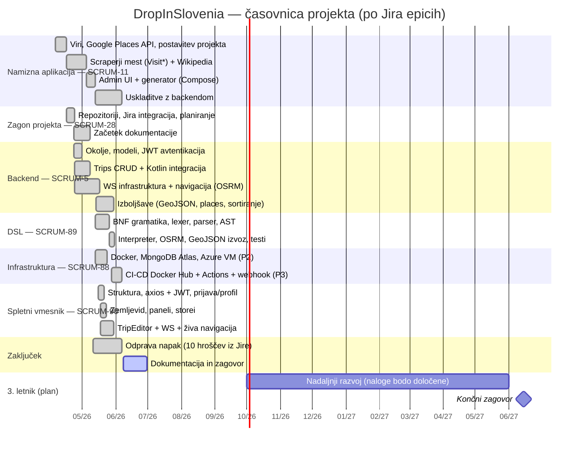

---
---

# 2. Primeri uporabe

## 2.1 Opis problema

Informacije, potrebne za načrtovanje izleta po Sloveniji — destinacije, nastanitve,
gostinska ponudba, znamenitosti in **aktualni dogodki** — so razpršene po številnih
ločenih virih (turistične platforme posameznih mest, Google, Wikipedija, zemljevidi).
Uporabnik mora podatke ročno združevati iz več strani, med samim izletom pa ni enotnega
orodja, ki bi ga **vodilo po načrtovani poti** in ga sproti obveščalo o dogajanju v bližini.

**DropInSlovenia** ta problem rešuje z eno aplikacijo, ki: (a) agregira točke interesa in
dogodke na interaktivnem zemljevidu, (b) omogoča sestavo večdnevnega potovanja s
postajami, in (c) med izletom v živo (prek GPS) izračunava pot, ETA in navodila do
naslednje postaje ter predlaga bližnje točke interesa.

### Matematična podlaga

Jedro problema je geoprostorsko: »kaj je blizu uporabnika«. Razdaljo med dvema GPS
točkama računamo s **Haversinovo formulo** (`backend/services/nearbyPlacesService.js`,
funkcija `haversine`):

$$
a = \sin^2\!\left(\frac{\varphi_2 - \varphi_1}{2}\right) + \cos\varphi_1 \cdot \cos\varphi_2 \cdot \sin^2\!\left(\frac{\lambda_2 - \lambda_1}{2}\right)
$$

$$
d = 2R \cdot \operatorname{atan2}\!\left(\sqrt{a},\ \sqrt{1-a}\right)
$$

kjer je $R = 6\,371\,000\ \text{m}$ (polmer Zemlje), $\varphi$ geografska širina in
$\lambda$ geografska dolžina (v radianih).

Z njo backend razvršča točke interesa po oddaljenosti od uporabnika (UC-2) in med
živo sejo izvaja **filter premika** (`min_moved` v `backend/sockets/wsHandlers.js`):
če se je uporabnik med dvema GPS popravkoma premaknil za manj kot `minMovedM` metrov,
se nova Overpass poizvedba ne sproži. Ostala geoprostorska izračuna prepuščamo
specializiranim orodjem: iskanje potovanj v bližini reši MongoDB operator `$near` nad
`2dsphere` indeksom (privzeti radij 50 km), najkrajšo pot in ETA do naslednje postaje
pa OSRM; pri ETA nad 30 minut sistem sproži priporočilo bližnjih postankov (F14, UC-3).

## 2.2 Primeri uporabe (sekvenčni diagrami)

### UC-1 — Registracija in prijava uporabnika (JWT)

Pokriva **F10**. Prikazuje preverjanje gesla (bcrypt) in izdajo para žetonov
(access + refresh).

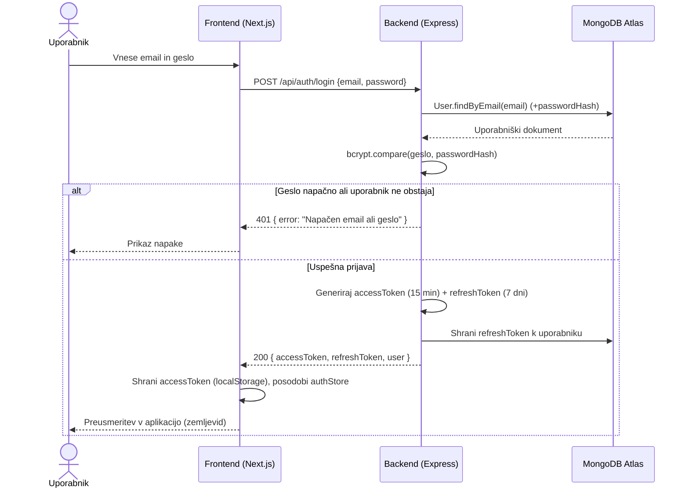

Registracija (`POST /api/auth/register`) poteka analogno: preverjanje obstoja emaila
(409 ob podvojitvi), hash gesla z bcrypt v Mongoose `pre('save')` hooku in takojšnja
izdaja istega para žetonov (201).

### UC-2 — Iskanje bližnjih točk interesa na zemljevidu

Pokriva **F02, F03, F04**. Prikazuje agregacijo POI iz OpenStreetMap (Overpass) z
Haversine razvrščanjem in odpornostjo (fallback endpoint).

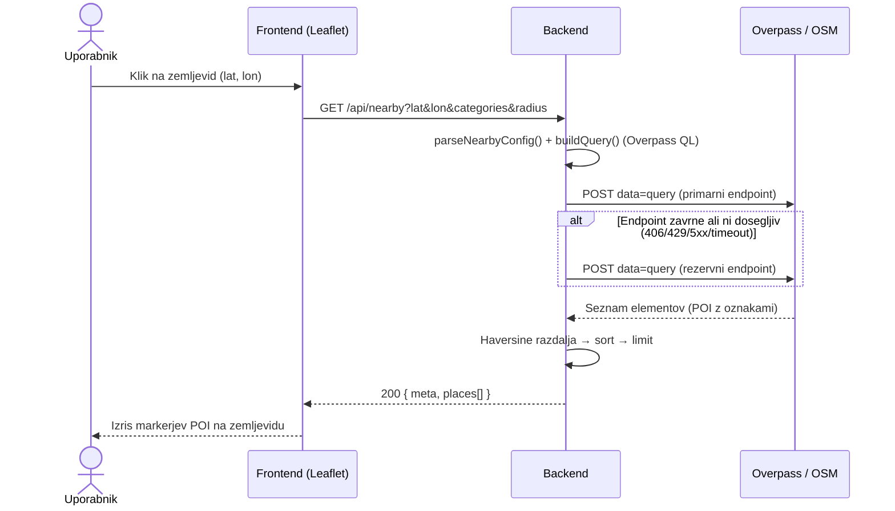

Isti servis (`fetchNearbyPlaces`) je dosegljiv tudi prek WebSocket sporočila
`{ type: "location", lat, lon }` med živo sejo — tam Haversinov filter premika
(`min_moved`) prepreči odvečne poizvedbe, dokler se uporabnik ne premakne dovolj daleč.

### UC-3 — Vodenje v živo z navigacijo (WebSocket)

Pokriva **F13 in F14** (ter F06 — pametna priporočila). Prikazuje WebSocket sejo s preverjanjem JWT ob *upgrade*,
ponavljajoče se posodabljanje lokacije in priporočila ob dolgi vožnji.

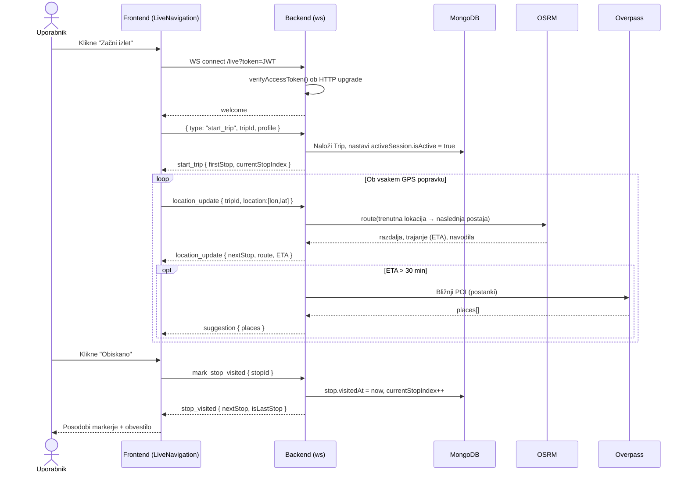

> **Opomba (stanje implementacije):** sporočilo `suggestion` backend pošlje po WS,
> spletna aplikacija pa zanj trenutno še nima registriranega obravnavalca
> (`wsClient.on('suggestion', …)`) — prikaz priporočil na UI je predviden kot nadgradnja.
> Ostala sporočila iz diagrama frontend obravnava: `start_trip`, `stop_visited`,
> `stop_trip` in `error` v `hooks/useLiveSession.ts`, `location_update` v
> `components/live/LiveNavigation.tsx` in `components/map/LiveRouteLayer.tsx`
> (ob odprtju povezave wsClient sproži interni dogodek `connected`).

---
---

# 3. Arhitektura programske rešitve

## 3.1 Diagram arhitekture

Sistem je sestavljen iz **treh komponent** in se povezuje z več zunanjimi viri.

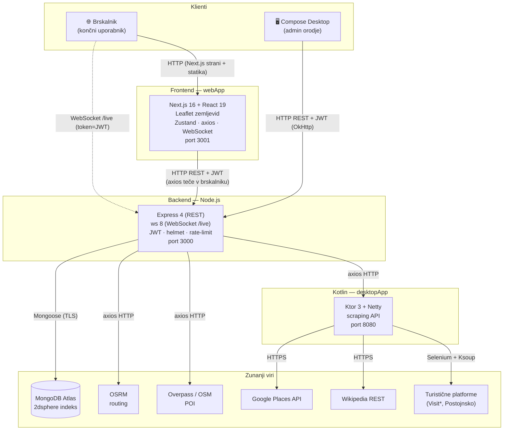

## 3.2 Tehnologije

### Programski jeziki in izvajalna okolja

| Komponenta | Jezik | Prevajalnik / izvajalnik | Spletni strežnik |
|---|---|---|---|
| Frontend | **TypeScript** (TSX) | `tsc` / SWC (Next.js build) | Next.js standalone (Node.js), **port 3001** |
| Backend | **JavaScript** (Node.js, CommonJS) | interpreter **Node.js v22** | Express 4 + lasten `http` strežnik + `ws`, **port 3000** |
| Kotlin scraping | **Kotlin** (JVM) | `kotlinc` prek Gradle 8.14 | **Ktor 3 + Netty**, **port 8080** |
| Kotlin admin | **Kotlin** (JVM) | `kotlinc` prek Gradle | Compose for Desktop (ni strežnik) |

### Podatkovna baza

- **MongoDB** (gostovan na **MongoDB Atlas**), dostop prek **Mongoose 9** (ODM).
- Dve zbirki: `users` in `trips` (z vgnezdenimi `stops`).
- Geoprostorski **`2dsphere`** indeks na `stops.location` omogoča `$near` poizvedbe;
  dodatni indeksi na `tags`, `owner`, `(isPublic, startDate)`.

### Komunikacijski protokoli TCP/IP sklada

| Sloj | Protokol | Uporaba |
|---|---|---|
| Aplikacijski | **HTTP/1.1** (REST, JSON) | brskalnik/desktop ↔ backend ↔ Kotlin/zunanji viri |
| Aplikacijski | **WebSocket** (`ws://…/live`) | živo vodenje (dvosmerno, nizka latenca) |
| Aplikacijski | **HTTPS / TLS** | klici Google Places, Wikipedia, OSRM, Atlas |
| Aplikacijski | **MongoDB wire protocol** (prek TLS, `mongodb+srv`) | backend ↔ baza |
| Transportni | **TCP** | vsi zgornji |

### Odprta vrata (porti)

| Vrata | Storitev | Opomba |
|---|---|---|
| **3001** | Frontend (Next.js) | dostop končnega uporabnika |
| **3000** | Backend (HTTP REST **in** WebSocket) | isti port za REST in `/live` |
| **8080** | Kotlin Ktor scraping API | kliče ga backend; na VM odprt tudi navzven (NSG `allow-kotlin`) |
| **9000** | `webhook` na produkcijski VM | sproži samodejni deploy (CI) |
| 27017 / 443 | MongoDB Atlas (`mongodb+srv`) | izhodna povezava backenda |
| 443 | OSRM, Overpass, Google Places, Wikipedia | izhodne povezave |

## 3.3 Knjižnice in API-ji

### Zunanji API-ji (kateri problem rešuje)

| API / vir | Komponenta | Problem, ki ga rešuje |
|---|---|---|
| **MongoDB Atlas** | Backend | Trajno shranjevanje; geoprostorske poizvedbe (`$near`). |
| **OSRM** | Backend | Izračun poti, razdalje, ETA in navigacijskih navodil. |
| **Overpass / OpenStreetMap** | Backend | Iskanje bližnjih POI po kategorijah — brezplačno, brez ključa. |
| **Google Places API** | Kotlin | Bogatejši podatki o krajih (ocene, naslov, fotografije, mnenja). |
| **Wikipedia REST API** | Kotlin | Kratek opis mesta (F15). |
| **Turistične platforme** | Kotlin | Aktualni dogodki po mestih (nimajo javnega API-ja → scraping). |

### Knjižnice po jezikih (in zakaj)

**Backend (JavaScript / Node.js):**

| Knjižnica | Zakaj / kateri problem rešuje |
|---|---|
| `express` | Minimalno, razširljivo REST ogrodje; de-facto standard za Node.js. |
| `mongoose` | ODM z validacijo shem, hooki (hash gesla, kaskadno brisanje) in indeksi. |
| `jsonwebtoken` | Stateless avtentikacija (access + refresh) brez sejne shrambe. |
| `bcryptjs` | Varno shranjevanje gesel (salt + hash, cost 12). |
| `ws` | Lahek WebSocket strežnik za živo vodenje, neodvisno od Express. |
| `helmet`, `cors`, `express-rate-limit` | Varnostni sloj (glavni, izvor, omejevanje zahtev). |
| `axios` | HTTP klient za klice zunanjih storitev. |
| `cheerio` | HTML parser (rezerva za scraping na Node strani). |
| `morgan`, `dotenv` | Logiranje zahtev; konfiguracija prek `.env`. |

**Frontend (TypeScript / Next.js):**

| Knjižnica | Zakaj / kateri problem rešuje |
|---|---|
| `next`, `react` | SSR/komponentno ogrodje (App Router, React 19). |
| `leaflet` + `react-leaflet` | Odprtokoden interaktivni zemljevid (brez plačljivih kvot). |
| `zustand` | Minimalen state management (storei po domeni). |
| `axios` | Enoten HTTP klient z interceptorji (JWT + samodejni refresh ob 401). |
| `tailwindcss` | Utility-first CSS za hiter razvoj UI. |

**Kotlin (JVM):**

| Knjižnica | Zakaj / kateri problem rešuje |
|---|---|
| `ktor-server` (+Netty) | Lahek async strežnik za scraping API. |
| `selenium-java` | Scraping JS-renderiranih turističnih strani (dinamična vsebina). |
| `ksoup` | Parsiranje HTML v Kotlinu (Jsoup-podoben). |
| `kotlinx-serialization-json` | Tipiziran JSON (`data class` ↔ JSON). |
| `okhttp` | HTTP klient admin aplikacije do backenda (s timeouti). |
| `kotlinx-coroutines` | Neblokirajoči klici — odziven UI. |
| `compose-multiplatform` / `material3` | Deklarativni namizni UI. |
| `kotlin-faker` | Generiranje realističnih testnih podatkov. |

## 3.4 Razredni diagrami

Ker projekt uporablja **tri programske jezike**, podajamo ločen razredni diagram za vsakega.

### 3.4.1 Backend (Node.js — Mongoose modeli in servisi)

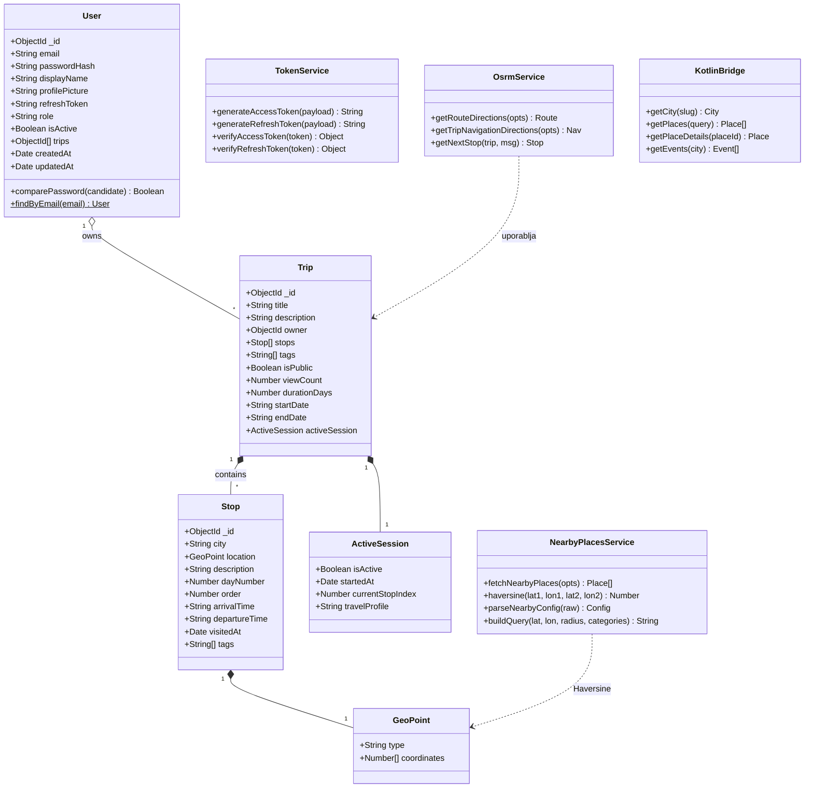

### 3.4.2 Frontend (TypeScript — tipi in Zustand storei)

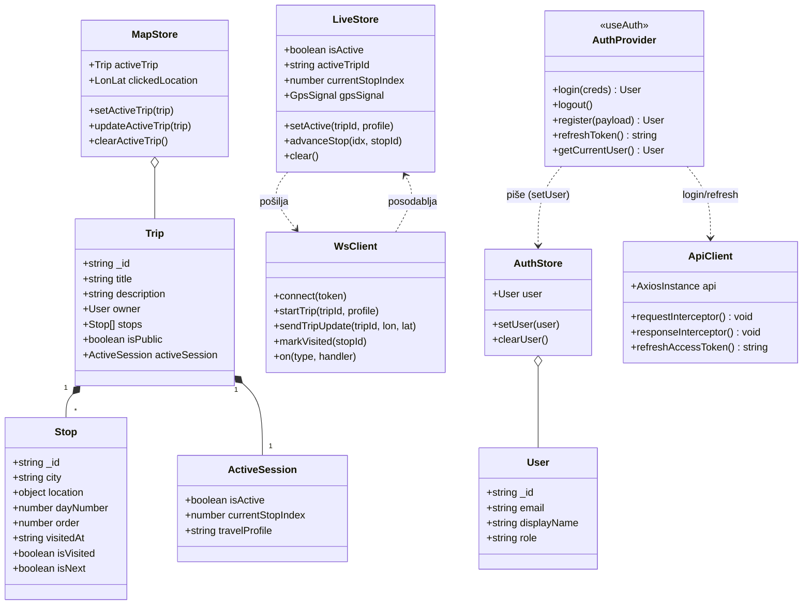

### 3.4.3 Kotlin (data modeli, servisi, UI)

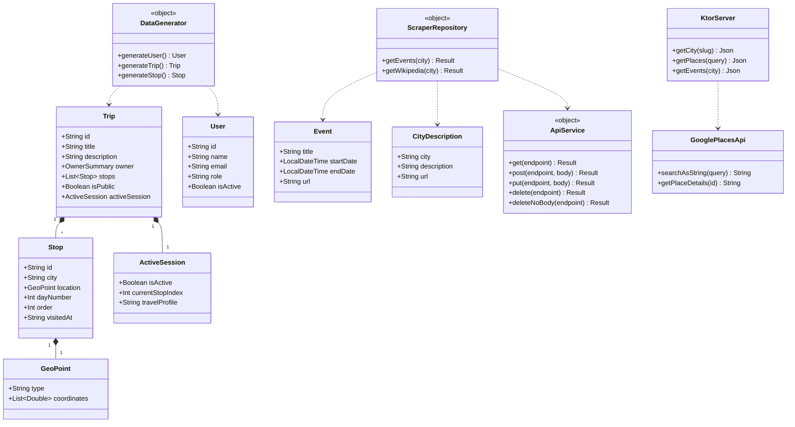

---
---

# 4. DevOps (CI/CD)

## 4.1 Pregled poteka dela

Vsak repozitorij ima **ločene GitHub Actions** poteke. Razvojni model temelji na vejah:
spremembe gredo najprej na razvojno vejo (`development` / `dev`), kjer se **samodejno
poženejo testi**; po združitvi v `main` se sproži **gradnja Docker slike, objava na
Docker Hub in samodejni deploy** prek **Webhook** protokola na produkcijsko VM.

Faze DevOps metodologije in pripadajoče akcije:

| Faza DevOps | Orodje / akcija v projektu |
|---|---|
| **Plan** | GitHub Issues / veje (`development`, `dev`, `feature/*`) |
| **Code** | trije repozitoriji v org. DropInSlovenia |
| **Build** | `docker/build-push-action` (Dockerfile za vsako komponento) |
| **Test** | GitHub Actions: `node --test` (backend), `vitest` + ESLint (frontend), `./gradlew jvmTest` (Kotlin) |
| **Release** | objava slike na **Docker Hub** (`dropinslovenia_frontend`, `_backend`, `_kotlin-server`, tag `:latest`) |
| **Deploy** | **Webhook** (`distributhor/workflow-webhook`) → `webhook` (adnanh, Go) na **VM:9000** → `deploy.sh` |
| **Operate** | `webhook.service` (systemd, `Restart=always`), Docker `--restart unless-stopped`, log v `/var/log/deploy.log` |

## 4.2 Diagram poteka — CI (testiranje)

Velja za **push na `development`/`dev`** in **pull request** proti `development`/`main`.

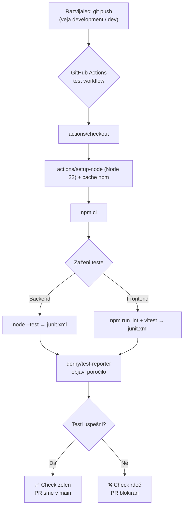

Podrobnost iz workflowov: frontend lint teče s `continue-on-error: true` (opozorila ne
blokirajo PR-ja), check je rdeč le ob padcu testov; vitest teče z `--passWithNoTests`.

## 4.3 Diagram poteka — CD (gradnja + objava + deploy prek webhook)

Velja za **push / merge na `main`**. Deploy workflow (`deploy.yml`) imajo **vsi trije
repozitoriji** (frontend, backend, kotlin-server) — vsak gradi svojo Docker sliko, jo
naloži na Docker Hub in pokliče **svoj** webhook (`/hooks/deploy-frontend`,
`/hooks/deploy-backend`, `/hooks/deploy-kotlin`). Tako push v en repozitorij posodobi
le pripadajočo storitev, ostali dve ostaneta nedotaknjeni.

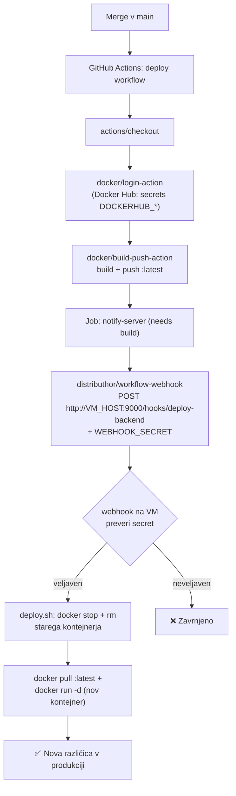

**Konkretna konfiguracija na VM (iz poročila P3):**

- **Webhook strežnik:** paket `webhook` (adnanh, Go), posluša na **portu 9000**, teče kot
  **systemd** servis `/etc/systemd/system/webhook.service` (`Restart=always`, zagon ob bootu).
- **Hooki:** `/etc/webhook/hooks.json` definira tri hooke — `deploy-frontend`,
  `deploy-backend`, `deploy-kotlin`. Vsak ima `trigger-rule` z **HMAC-SHA256** preverjanjem
  (header `X-Hub-Signature-256`), tako da se skripta izvede **le** ob veljavnem podpisu.
- **Deploy skripta:** `/opt/deploy/deploy.sh` sprejme ime storitve (`$1`) iz JSON payloada
  (`{"service": "..."}`), nato: `docker stop` + `docker rm` star kontejner → `docker pull`
  sveže `:latest` slike z Docker Hub → `docker run -d --env-file <.env> --restart unless-stopped`.
  Vsak korak se beleži v `/var/log/deploy.log` z datumom in uro.
- **Skrivnosti:** `.env` (Mongo URI, JWT skrivnosti) se v kontejner naloži prek `--env-file`,
  nikoli ni zapisan v skripti ali logih.

> **Znane omejitve (analiza v P3):** secret je trenutno v `hooks.json` v čistopisu, webhook
> teče prek HTTP (ne HTTPS), deploy user ima dostop do `.env` in Dockerja. Priporočene
> izboljšave (ločen `deployer` user, secret iz env spremenljivke, TLS prek nginx) so opisane
> v poglavju 5.6.

## 4.4 Kontejnerizacija

| Komponenta | Osnova slike | Posebnosti |
|---|---|---|
| Backend | `node:22-alpine` | `npm ci --omit=dev`, EXPOSE 3000 |
| Frontend | `node:22-alpine` (večstopenjski) | Next.js `standalone`, EXPOSE 3001, `NEXT_PUBLIC_API_URL` kot build-arg |
| Kotlin | `gradle:8.5-jdk21` → `eclipse-temurin:21-jre-alpine` | namesti Chromium + ChromeDriver za Selenium, EXPOSE 8080 |

Orkestracija: `docker-compose.yml` (tri storitve, `depends_on`, `restart: unless-stopped`).
Vrstni red zagona: `kotlin-server` → `backend` → `frontend`. Backend dobi
`KOTLIN_SERVICE_URL=http://kotlin-server:8080`, frontend pa `API_URL=http://backend:3000`
(komunikacija po internem Docker omrežju, ne prek `localhost`).

Dejanske `build.context` poti (iz P2): `./desktopApp` (kotlin-server), `./backend`,
`./webApp` z `dockerfile: frontend/Dockerfile`. Frontend prejme javni IP VM kot build-arg:
`NEXT_PUBLIC_API_URL=http://68.210.138.63:3000` (Next.js ga vtisne v JS bundle že ob gradnji,
zato mora biti podan med `docker build`, ne ob zagonu).

> **Opomba o dveh načinih namestitve:** za **lokalni razvoj** se uporablja en
> `docker-compose.yml` z eno centralno `.env` (vse tri storitve hkrati). V **produkciji na VM**
> pa se vsaka storitev posodablja **neodvisno** prek CI/CD (GitHub Actions → Docker Hub →
> webhook → `deploy.sh` zažene posamezen `docker run`), ne prek `docker compose`.

## 4.5 Produkcijska infrastruktura in register slik

**Strežnik (Azure VM, iz P2):**

| Parameter | Vrednost |
|---|---|
| Ponudnik / naročnina | Microsoft Azure — **Azure for Students** |
| Resource group | `DropInSlovenia_group_05191709` |
| Ime VM | `dropinslovenia-vm` |
| Regija | **Austria East (Zone 2)** _(West Europe ni bil na voljo za to naročnino)_ |
| OS | **Ubuntu Server 24.04 LTS** |
| Velikost | **Standard B2ts v2** (2 vCPU, 1 GiB RAM) |
| Disk | **Premium SSD LRS, 30 GB** (3× replikacija v istem podatkovnem centru) |
| Javni IP | **68.210.138.63** |

> Ker ima VM le **1 GiB RAM**, vse tri storitve skupaj (frontend ~150–200 MB, backend ~100 MB,
> Kotlin JVM ~256 MB + OS) ob gradnji presežejo RAM. Zato je dodana **2 GB swap datoteka**
> (`/swapfile`, trajno v `/etc/fstab`), ki prepreči sesutje VM med `docker build`.

**Register slik (Docker Hub, iz P3):**

- Tri slike: `dropinslovenia_frontend`, `dropinslovenia_backend`, `dropinslovenia_kotlin-server`
  (tag `:latest`, ki ga GitHub Actions prepiše ob vsakem deployu).
- Prijava v CI prek **Access Tokena** (ne gesla) — token ima omejene pravice in ga je ob
  morebitnem uhajanju mogoče takoj preklicati.
- Možna nadgradnja: dodatno tagiranje s `${{ github.sha }}` za rollback na prejšnjo verzijo.

**GitHub Secrets (v vseh treh repozitorijih):** `DOCKERHUB_USERNAME`, `DOCKERHUB_TOKEN`,
`WEBHOOK_SECRET`, `VM_HOST` — šifrirani, nikoli vidni v logih, referencirani prek
`${{ secrets.IME }}`.

**Testna ogrodja (CI nad razvojno vejo):**

| Komponenta | Veja sprožilca | Ogrodje | Stanje |
|---|---|---|---|
| Backend | `development` (+ PR v `development`/`main`) | vgrajeni `node --test` | Testni *workflow* pripravljen; unit testi v pripravi (kandidata: `utils/osrmToGeoJSON.js`, `utils/asyncHandler.js`) |
| Frontend | `dev` (+ PR v `dev`/`main`) | ESLint + `vitest` (`--passWithNoTests`) | Lint in testni okvir pripravljena; unit testi v pripravi (kandidat: `lib/utils/tokens.ts`) |
| Kotlin | `dev` (+ PR) | `kotlin.test` prek `./gradlew jvmTest` | Delujoč test `composeApp/src/jvmTest/.../ComposeAppDesktopTest.kt` |

Rezultati se objavijo prek `dorny/test-reporter` v zavihku **Checks** (JUnit XML).

---
---

# 5. Varnost programske rešitve

## 5.1 Varnostne vloge uporabnikov

Sistem pozna **dve vlogi** (`role` polje na uporabniku), ki ju uveljavljajo middleware funkcije:

| Vloga | Pravice |
|---|---|
| `user` | Dostop do svojega profila in svojih potovanj; ustvarjanje/urejanje/brisanje **lastnih** potovanj; ogled javnih potovanj. |
| `admin` | Vse pravice: upravljanje vseh uporabnikov, ogled in urejanje **vseh** potovanj (vključno z `?all=true`), prestavljanje lastništva. |

Uveljavljanje (v `backend/middleware/authMiddleware.js` + controllerji):

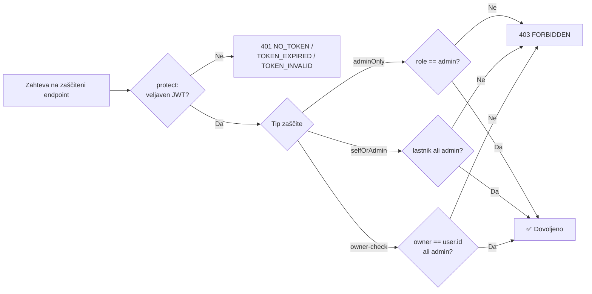

- **`protect`** — zahteva veljaven JWT (`Authorization: Bearer <token>`).
- **`adminOnly`** — samo admin (npr. seznam vseh uporabnikov, brisanje uporabnikov).
- **`selfOrAdmin`** — lastnik vira ali admin (dostop do svojega profila).
- **owner-check** — v `tripsController` (uredi/izbriši le svoje potovanje); vidljivost
  zasebnih potovanj (`isPublic:false`) se preverja v `getTripById`, `route/geojson` in WS `start_trip`.

## 5.2 Avtentikacija in žetoni (JWT)

- **Dva ločena žetona:** *access* (veljaven 15 min) in *refresh* (veljaven 7 dni),
  podpisana z **ločenima skrivnostma** (`ACCESS_TOKEN_SECRET`, `REFRESH_TOKEN_SECRET`).
- **Rotacija:** ob `POST /api/auth/refresh` se izda nov par; shranjeni refresh token v
  bazi se primerja in zamenja (omeji ponovno uporabo ukradenega žetona).
- **WebSocket:** JWT se preveri že ob HTTP *upgrade* zahtevi (`server.js`), pred
  vzpostavitvijo seje; ob neveljavnem žetonu je povezava zavrnjena (401). Ena aktivna
  seja na uporabnika (nova zapre staro).
- **Frontend:** v `localStorage` hrani **samo access žeton**; axios interceptor ob `401`
  pokliče `POST /api/auth/refresh` in ob uspehu ponovi prvotno zahtevo
  (`lib/api/client.ts`). *Znana omejitev:* spletni odjemalec refresh žetona ne shranjuje
  in ga pri klicu ne pošlje, backend pa ga pričakuje v telesu zahteve — osvežitev zato v
  trenutni izvedbi ne uspe in je po poteku access žetona (15 min) potrebna ponovna prijava.

## 5.3 Varovanje podatkov

- **Gesla:** nikoli shranjena v čistopisu — **bcrypt** (salt + hash, cost 12).
  Polje `passwordHash` ima `select:false` in se **nikdar** ne vrne v API odgovorih.
- **Refresh token** v bazi je prav tako `select:false`.
- **Validacija vhoda:** Mongoose sheme (regex za email, dolžine nizov, formati
  `HH:mm` / `YYYY-MM-DD`, veljavnost GeoJSON koordinat); sanitizacija postaj
  (`sanitizeStops` odstrani nepopolne koordinate).
- **Tajnosti:** v `.env` (ni v repozitoriju), v CI/CD prek **GitHub Secrets**
  (`DOCKERHUB_*`, `WEBHOOK_SECRET`, `VM_HOST`, Mongo poverilnice, JWT skrivnosti).
- **Šifriran prenos:** povezave do MongoDB Atlas, OSRM, Google in Wikipedije potekajo
  prek TLS (HTTPS / `mongodb+srv`).

## 5.4 Omejitve uporabnikov in zaščita aplikacijskega sloja

| Mehanizem | Konfiguracija | Namen |
|---|---|---|
| **Rate limiting** (`express-rate-limit`) | privzeto **100 zahtev / 15 min** na `/api` | zaščita pred zlorabo in (D)DoS na aplikacijskem sloju |
| **helmet** | varni HTTP headerji | zaščita pred XSS, clickjacking, MIME-sniffing |
| **CORS** | whitelist iz `CORS_ORIGIN`, `credentials:true` | dovoli le znane izvore |
| **Omejitev velikosti telesa** | `express.json({ limit: '1mb' })` | preprečuje velike payload napade |
| **Centralni error handler** | enotni odgovori | ne razkriva *stack trace* / notranjosti |
| **Deaktivacija računa** | `isActive:false` | prijava blokirana (403) |

## 5.5 Požarni zid in omrežna varnost (dvonivojska zaščita)

Sistem uporablja **dva sloja požarnega zidu**: oblačni Azure NSG (na ravni omrežja Azure)
in sistemski UFW (na ravni operacijskega sistema VM). Oba sta dejansko konfigurirana (P2/P3).

### Sloj 1 — Azure Network Security Group (NSG)

NSG je virtualni požarni zid, ki ga vsak Azure VM dobi samodejno. Privzeto so **vsa vhodna
vrata zaprta razen 22 (SSH)** — načelo najmanjših privilegijev. Z *Inbound port rules*
(VM → Networking → Create port rule) so navzven odprta le nujna vrata:

| Vrata | Pravilo | Protokol | Namen |
|---|---|---|---|
| 22 | (privzeto) | TCP | SSH dostop |
| 3000 | `allow-backend` | TCP | Node.js/Express REST API + WebSocket |
| 3001 | `allow-frontend` | TCP | Next.js frontend |
| 8080 | `allow-kotlin` | TCP | Kotlin Ktor scraping API |
| 9000 | `allow-webhook` | TCP | Deploy webhook (CI/CD) |

### Sloj 2 — UFW na VM (dodatno zaklepanje porta 9000)

Na sami VM je nameščen **UFW** (Uncomplicated Firewall). Ključno: port **9000 (webhook) je
omejen samo na GitHub Actions IP obsege** — torej ga ne more klicati kdorkoli z interneta,
tudi če pozna URL:

```bash
sudo ufw allow 22
sudo ufw allow 3000
sudo ufw allow 3001
sudo ufw allow 8080
sudo ufw deny  9000                                   # zapri za vse
sudo ufw allow from 140.82.112.0/20  to any port 9000 # samo GitHub Actions
sudo ufw allow from 185.199.108.0/22 to any port 9000
sudo ufw allow from 192.30.252.0/22  to any port 9000
sudo ufw --force enable
```

> GitHub IP obsegi se občasno spremenijo; aktualni seznam je na
> <https://api.github.com/meta> pod ključem `actions`.

### Ostala omrežna varnost

- **SSH:** prijava prek **para ključev `ed25519`** (vsak član svoj javni ključ v
  `~/.ssh/authorized_keys`, pravice `700`/`600`) — varneje od gesla, odporno na brute-force.
- **MongoDB Atlas:** ločen bazni uporabnik (`dropinslovenia-user`) z geslom; povezava prek
  TLS (`mongodb+srv`). **IP allowlist je v razvoju nastavljen na `0.0.0.0/0`** (dostop iz
  lokalnih okolij in VM); za produkcijo je priporočeno zožiti na **samo IP VM (68.210.138.63)**.
- **Izolacija:** vsaka komponenta v ločenem Docker kontejnerju; `restart: unless-stopped`
  za samodejno okrevanje po napaki ali rebootu VM.

## 5.6 Varnost CI/CD in webhook poteka

Deploy prek webhooka je posebej zaščiten, saj sproži spremembe v produkciji:

- **HMAC-SHA256 podpis (implementirano):** GitHub Actions ob vsakem klicu podpiše payload z
  `WEBHOOK_SECRET` (header `X-Hub-Signature-256`); webhook strežnik na VM izračuna isti podpis
  in primerja. Brez poznavanja skrivnosti ni mogoče ustvariti veljavnega podpisa → deploy se
  ne izvede. Test: `curl http://<IP>:9000/hooks/deploy-backend` vrne *"Hook rules were not
  satisfied."* (zahteva veljaven podpis).
- **Docker Hub Access Token** namesto gesla (omejene pravice, takojšen preklic).
- **GitHub Secrets** za vse poverilnice (nikoli v YAML/git).

**Znane luknje in priporočene izboljšave (analiza iz P3):**

| Luknja | Tveganje | Predlagana rešitev |
|---|---|---|
| Webhook prek HTTP (ne HTTPS) | MITM vidi metapodatke deployev | TLS prek nginx + Let's Encrypt (`certbot`) |
| `WEBHOOK_SECRET` v `hooks.json` v čistopisu | viden vsem z SSH dostopom | branje iz env spremenljivke v `webhook.service` |
| Deploy user ima dostop do `.env` in Dockerja | ob zlorabi eskalacija do skrivnosti/root | ločen `deployer` user z minimalnimi pravicami |
