# Poročilo P3 — CI/CD (Docker Hub + GitHub Actions + Webhook)
## DropInSlovenia


**Skupina:** Matija Dukarić (vodja), Maj Donko, Luka Manfreda  

---


## Razdelitev nalog


| Task | Opis | Assignee |
|------|------|----------|
| TASK-16 | Docker Hub račun in repozitoriji | Matija Dukarić |
| TASK-17 | Ročni push Docker slik | Maj (frontend), Luka (backend + kotlin) |
| TASK-18 | GitHub Secrets v vseh repozitorijih | Matija Dukarić |
| TASK-19 | GitHub Actions workflow — Frontend | Maj Donko |
| TASK-20 | GitHub Actions workflow — Backend | Luka Manfreda |
| TASK-21 | GitHub Actions workflow — Kotlin | Matija Dukarić |
| TASK-22 | Deploy skripta na VM | Luka Manfreda |
| TASK-23 | Webhook konfiguracija + systemd | Matija Dukarić |
| TASK-24 | Test celotnega CI/CD pipeline | Vsi |
| TASK-25 | Varnostna analiza + UFW firewall | Maj (dokumentacija), Matija (implementacija) |
| TASK-26 | Opis dodatnih GitHub Actions workflows | Maj Donko |
| TASK-27 | Pisanje poročila P3 | Luka (koordinacija) |

---


## 0. Pregled CI/CD arhitekture


*Avtor: Matija Dukarić*


**Kaj je CI/CD?** CI/CD (Continuous Integration / Continuous Delivery) je praksa kjer se vsaka sprememba kode samodejno zgradi, testira in dostavi v produkcijo — brez ročnega posredovanja. Cilj je da vsak `git push` na `main` branch samodejno posodobi aplikacijo na strežniku.


**Naš CI/CD tok:**


```
Razvijalec naredi spremembo v kodi
         │
         ▼
    git push na main
         │
         ▼
  GitHub Actions zazna push
         │
         ├─── Zgradi Docker sliko iz Dockerfile
         ├─── Naloži sliko na Docker Hub (nova verzija)
         │
         ▼ (samo če je zgornje uspelo)
  Pošlje webhook HTTP zahtevo na Azure VM
         │
         ▼
  VM: webhook strežnik sprejme zahtevo
         │
         ├─── Preveri HMAC podpis (varnostno preverjanje)
         ├─── Zažene deploy.sh skripto
         │       ├─── Ustavi stari container
         │       ├─── Prenese novo sliko z Docker Hub
         │       └─── Zažene nov container
         ▼
  Aplikacija je posodobljena na VM 
```


**Zakaj 3 ločeni workflow-i?** Ker imamo 3 ločene repozitorije (frontend, backend, kotlin-server), vsak dobi svojo workflow datoteko. Ko pushamo spremembo samo v backend repozitorij, se zgradi in deployira samo backend — frontend in kotlin-server ostaneta nedotaknjena.


**Dve veji, dva tipa sprotne integracije.** CI/CD smo razdelili glede na vejo:
- **Razvojna veja `dev`** — ob vsaki potrditvi (commit) ali pull requestu se samodejno zaženejo **testi enot** (angl. unit testing) in objavi se **poročilo o rezultatih** (sekcija 2.2). Tu se koda **ne** deployira — namen je hitra povratna informacija ali sprememba česa ne pokvari.
- **Produkcijska veja `main`** — ob vsaki potrditvi se koda **prevede, zapakira v Docker sliko in deployira** na strežnik (sekcije 2.3–2.5 in 3). Tako v produkcijo pride samo koda, ki je bila prej stestirana na `dev`.


**Opomba o GitLab vs GitHub.** Navodila naloge omenjajo poročanje s strani GitLaba; mi smo celoten projekt razvijali na **GitHubu** (organizacija `DropInSlovenia`), zato smo sprotno integracijo izvedli z **GitHub Actions**. GitHub Actions je funkcionalno enakovreden GitLab CI/CD — opravlja avtomatsko testiranje, gradnjo, pakiranje, deploy in poročanje o rezultatih.


---

## 1. Docker Hub Container Registry


### 1.1 Ustvaritev računa in repozitorijev
*Avtor: Matija Dukarić*


**Kaj je Docker Hub?** Docker Hub je javni register Docker slik — podobno kot GitHub za kodo, le da shranjuje Docker slike. Ko GitHub Actions zgradi sliko, jo naloži sem. Ko VM potrebuje novo verzijo, jo prenese od sem.


**Zakaj Access Token namesto gesla?** Access Token je poseben ključ z omejenimi pravicami (samo branje/pisanje slik, ne upravljanje računa). Če bi bil token odtujen (npr. uhajanje iz GitHub Secrets), ga v sekundi pobrišemo in naredimo novega — brez da bi morali menjati geslo računa. Geslo ima polne pravice, token pa ne.


*Slika: Docker Hub dashboard z vsemi 3 repozitoriji*

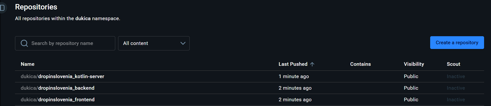


---


### 1.2 CLI ukazi za container registry
*Avtor:*


Dokumentirani ukazi in razlaga:


```bash
# Prijava na Docker Hub
# Ko te vpraša za geslo, vnesi ACCESS TOKEN (ne pravega gesla)
docker login -u dropinslovenia


# Gradnja slike z imenom in tagom
# Format: docker build -t <username>/<repozitorij>:<tag> <pot_do_konteksta>
docker build -t dropinslovenia/frontend:latest ./frontend


# Nalaganje slike na Docker Hub
# Docker Hub prepozna username/repozitorij in naloži tja
docker push dropinslovenia/frontend:latest


# Prenos slike z Docker Hub na lokalni računalnik ali VM
docker pull dropinslovenia/frontend:latest


# Pregled vseh lokalnih slik
docker images


# Brisanje lokalne slike (sprosti prostor na disku)
docker rmi dropinslovenia/frontend:latest


# Zagon containerja neposredno iz Docker Hub slike (brez lokalnega builda)
docker run -d -p 3001:3001 dropinslovenia/frontend:latest
```


**Tag `:latest`:**


`:latest` je konvencionalni tag za zadnjo verzijo. GitHub Actions ga prepiše ob vsakem deploymentu — vedno kaže na trenutno najnovejšo sliko, skripta na strežniku pa vedno potegne prav to oznako. Tako ostane delovni tok preprost.


Možna nadgradnja: sliko bi lahko dodatno tagirali z Git commit hashem (`:${{ github.sha }}`), kar bi ohranilo zgodovino slik in omogočilo vračanje na prejšnjo verzijo (rollback) z `docker pull dropinslovenia/frontend:<sha>`.


V GitHub Actions workflowu naložimo oznako takole:
```yaml
tags: dropinslovenia/frontend:latest
```


---


## 2. GitHub Actions Workflows


V vsakem repozitoriju imamo **dva tipa workflow datotek** v mapi `.github/workflows/`:
- `test.yml` — sproži se ob potrditvah na **razvojni veji `dev`** in poganja teste enot s poročanjem (sekcija 2.2).
- `deploy.yml` — sproži se ob potrditvah na **produkcijski veji `main`** in zgradi, zapakira ter deployira Docker sliko (sekcije 2.3–2.5).


### 2.1 GitHub Secrets
*Avtor:*


**Kaj so GitHub Secrets?** GitHub Secrets so šifrirane spremenljivke shranjene v GitHub repozitoriju. V workflow YAML datotekah jih referenciramo z `${{ secrets.IME }}`. Vrednosti so šifrirane in nikoli vidne v logih — niti lastniku repozitorija po shranitvi.


**Zakaj ne direktno v YAML?** Ker so workflow datoteke v git repozitoriju in git je (v našem primeru) javen. Kdorkoli bi videl geslo ali token v plaintext YAML datoteki.


**Zakaj potrebujemo `WEBHOOK_SECRET`?** Webhook strežnik na VM mora preveriti da zahteva res prihaja iz GitHub Actions in ne od nekoga ki je uganil naš URL. HMAC podpis z deljenim secretom to zagotovi — brez pravega secreta ni mogoče ustvariti veljavnega podpisa.


Za vsak repozitorij (frontend, backend, kotlin-server) nastavi secrets:
**GitHub → Settings → Secrets and variables → Actions → New repository secret**


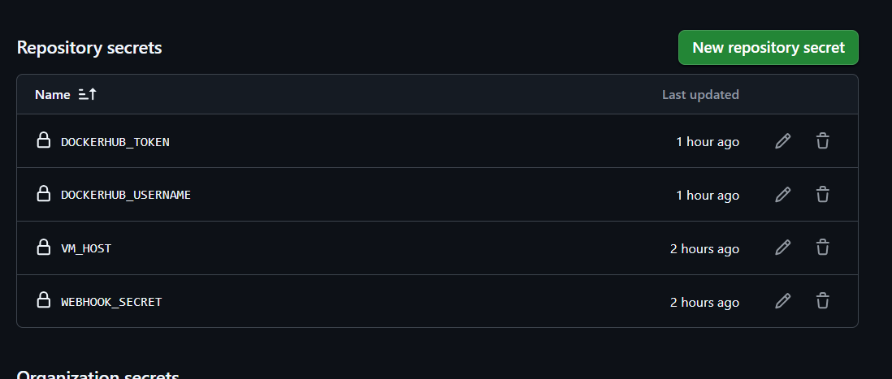


---


### 2.2 Sprotna integracija nad razvojno vejo — testiranje enot
*Avtor:*


To poglavje pokriva **prvo zahtevo naloge**: sprotno integracijo nad razvojno vejo (`dev`) z avtomatskim testiranjem enot in poročanjem.


**Kako deluje?** V vsakem repozitoriju je workflow `test.yml`, ki se sproži ob vsakem `push` na vejo `dev` in ob vsakem pull requestu proti `dev` ali `main`. Workflow namesti odvisnosti, zažene teste enot in ustvari **JUnit poročilo**. Poročilo objavimo z akcijo `dorny/test-reporter`, ki rezultate prikaže neposredno v GitHub vmesniku (zavihek **Checks** na commitu/PR-ju: koliko testov je prestalo, koliko padlo).


**Zakaj prav na `dev` veji?** Razvijalec dela na `dev` (oz. feature) veji. Ob vsakem pushu takoj dobi povratno informacijo, ali so njegove spremembe pokvarile katero od obstoječih funkcionalnosti — še preden se koda zlije v `main` in deployira v produkcijo. To je bistvo sprotne integracije (CI).


**Testna ogrodja po komponentah:**

| Komponenta | Ogrodje | Kaj testiramo |
|------------|---------|---------------|
| Backend (Node.js) | vgrajeni `node:test` | pretvorba OSRM odgovora v GeoJSON (`osrmToGeoJSON`), `asyncHandler` ovojnica |
| Frontend (Next.js) | `vitest` + `jsdom` | shranjevanje/branje access tokena (`tokens.ts`) |
| Kotlin (desktopApp) | `kotlin.test` (Gradle) | logika v `composeApp` (`jvmTest`) |


**Workflow datoteka (primer backend): `backend/.github/workflows/test.yml`**


```yaml
name: Testi Backend

on:
  push:
    branches: [ development ]          # sproži se ob potrditvi na razvojni veji
  pull_request:
    branches: [ development, main ]

permissions:
  contents: read
  checks: write                # potrebno, da dorny/test-reporter objavi poročilo

jobs:
  test:
    runs-on: ubuntu-latest
    steps:
      - uses: actions/checkout@v4

      - name: Namesti Node.js
        uses: actions/setup-node@v4
        with:
          node-version: 22
          cache: npm

      - name: Namesti odvisnosti
        run: npm ci

      - name: Zaženi unit teste in ustvari JUnit poročilo
        run: >
          node --test
          --test-reporter spec --test-reporter-destination=stdout
          --test-reporter junit --test-reporter-destination=junit.xml

      - name: Objavi poročilo o testih
        uses: dorny/test-reporter@v1
        if: always()
        with:
          name: Backend unit testi
          path: junit.xml
          reporter: java-junit
```


**Frontend** (`frontend/.github/workflows/test.yml`) je enak po strukturi, le da teste poganja z `vitest`:
```yaml
name: Testi Frontend

on:
  push:
    branches: [ dev ]
  pull_request:
    branches: [ dev, main ]

permissions:
  contents: read
  checks: write

jobs:
  test:
    runs-on: ubuntu-latest
    steps:
      - uses: actions/checkout@v5

      - name: Namesti Node.js
        uses: actions/setup-node@v5
        with:
          node-version: 22
          cache: npm

      - name: Namesti odvisnosti
        run: npm ci

      - name: Lint
        run: npm run lint
        continue-on-error: true

      - name: Zaženi unit teste in ustvari JUnit poročilo
        run: npx vitest run --passWithNoTests --reporter=default --reporter=junit --outputFile=junit.xml

      - name: Objavi poročilo o testih
        uses: dorny/test-reporter@v2
        if: ${{ always() && hashFiles('junit.xml') != '' }}
        with:
          name: Frontend unit testi
          path: junit.xml
          reporter: java-junit
```


**Kotlin** (`desktopApp/.github/workflows/test.yml`) uporablja JDK 21 in Gradle. Gradle že sam ustvari JUnit XML poročila v `composeApp/build/test-results/jvmTest/`:
```yaml
name: Testi Kotlin

  on:
    push:
      branches: [ dev ]
    pull_request:
      branches: [ dev, main, master ]

  permissions:
    contents: read
    checks: write

  jobs:
    test:
      runs-on: ubuntu-latest
      steps:
        - uses: actions/checkout@v4

        - uses: actions/setup-java@v4
          with:
            distribution: temurin
            java-version: 21

        - uses: gradle/actions/setup-gradle@v4

        - name: Zaženi jvmTest
          run: |
            chmod +x ./gradlew
            ./gradlew jvmTest --no-daemon

        - name: Objavi poročilo o testih
          uses: dorny/test-reporter@v1
          if: always()
          with:
            name: Kotlin unit testi
            path: composeApp/build/test-results/jvmTest/*.xml
            reporter: java-junit
```


**Kako preveriti, da deluje:**
1. Na veji `dev` naredi spremembo in `git push origin dev`
2. GitHub → zavihek **Actions** → odpre se "Testi ..." workflow
3. Po zaključku se v zavihku **Checks** (na commitu/PR-ju) prikaže poročilo: število uspešnih/neuspešnih testov

*Slike: GitHub Actions — uspešen "Testi" workflow run z zelenimi testi*

Kotlin server:
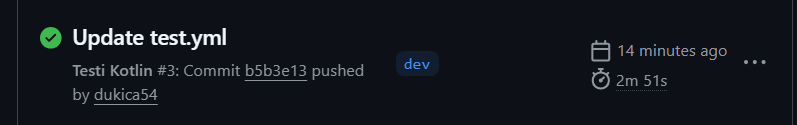

WebApp:

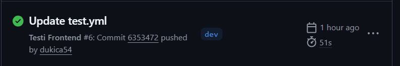

Backend

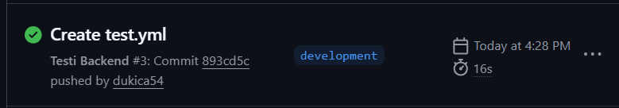

---


### 2.3 Workflow — Frontend (produkcijska veja)
*Avtor*


**Kaj je GitHub Actions workflow?** Workflow je YAML datoteka v `.github/workflows/` mapi repozitorija ki opisuje avtomatizirane korake. GitHub ga samodejno zazna in izvaja ob določenih dogodkih (npr. push na main).


**Struktura našega workflow-a:**


Workflow ima **dva joba** ki tečeta zaporedno:
1. `build-and-push` — zgradi Docker sliko in jo naloži na Docker Hub
2. `notify-server` — pošlje webhook sporočilo na Azure VM


**Ključna beseda `needs: build-and-push`** pove GitHub Actions da naj `notify-server` job počaka na uspešen zaključek `build-and-push` joba. Če build ne uspe (npr. napaka v kodi), se webhook ne pošlje in na VM ostane stara delujoča verzija. To je namerna odločitev — ne deployiramo pokvarjene verzije.


**Tag `:latest`** — sliko označimo z `latest`, skripta na strežniku pa vedno potegne to oznako. Tako ostane delovni tok preprost (kot zahteva naloga). Možna nadgradnja bi bila dodatno tagiranje s commit hashem `${{ github.sha }}`, kar bi omogočalo vračanje na prejšnjo verzijo (rollback).


**`build-args`** prenese `NEXT_PUBLIC_API_URL` med Docker buildom. Next.js ta URL **vtisne v JavaScript bundle med kompilacijo** — zato ga moramo podati takrat. Vrednost je `http://<VM_HOST>:3000/api` — javni IP Azure VM.


```yaml
name: CI/CD Frontend

on:
  push:
    branches: [ main ]

jobs:
  # JOB 1: Zgradimo Docker sliko in jo naložimo na Docker Hub
  build-and-push:
    runs-on: ubuntu-latest
    steps:
      - name: Checkout kode
        uses: actions/checkout@v5

      - name: Prijava na Docker Hub
        uses: docker/login-action@v3
        with:
          username: ${{ secrets.DOCKERHUB_USERNAME }}
          password: ${{ secrets.DOCKERHUB_TOKEN }}

      - name: Gradnja in push Docker slike
        uses: docker/build-push-action@v6
        with:
          context: .
          push: true
          tags: ${{ secrets.DOCKERHUB_USERNAME }}/dropinslovenia_frontend:latest
          # VM_HOST je javni IP Azure VM — NEXT_PUBLIC_* se vtisne v Next.js bundle ob buildu
          build-args: |
            NEXT_PUBLIC_API_URL=http://${{ secrets.VM_HOST }}:3000/api

  # JOB 2: Obvesti VM — zažene se SAMO če je Job 1 uspel
  notify-server:
    runs-on: ubuntu-latest
    needs: build-and-push
    steps:
      - name: Pošlji webhook na VM
        uses: distributhor/workflow-webhook@v3
        with:
          webhook_url: http://${{ secrets.VM_HOST }}:9000/hooks/deploy-frontend
          webhook_secret: ${{ secrets.WEBHOOK_SECRET }}
          data: '{"service": "frontend"}'
```


*Slika: GitHub Actions — uspešen frontend workflow run z obema zelenima joboma*

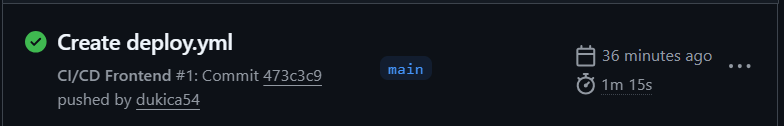

---


### 2.4 Workflow — Backend (produkcijska veja)
*Avtor*


Backend workflow je strukturno enak frontend workflowu z eno razliko — ni `build-args`. Backend (Node.js) bere environment spremenljivke dinamično ob zagonu z `process.env.KOTLIN_SERVER_URL` — ne med buildom. Zato ni treba ničesar vtiskati v sliko.


```yaml
name: CI/CD Backend

on:
  push:
    branches: [ main ]

jobs:
  build-and-push:
    runs-on: ubuntu-latest
    steps:
      - uses: actions/checkout@v4

      - name: Login to Docker Hub
        uses: docker/login-action@v3
        with:
          username: ${{ secrets.DOCKERHUB_USERNAME }}
          password: ${{ secrets.DOCKERHUB_TOKEN }}

      - name: Build and push
        uses: docker/build-push-action@v5
        with:
          context: .
          push: true
          tags: ${{ secrets.DOCKERHUB_USERNAME }}/dropinslovenia_backend:latest

  notify-server:
    runs-on: ubuntu-latest
    needs: build-and-push
    steps:
      - name: Webhook na VM
        uses: distributhor/workflow-webhook@v3
        with:
          webhook_url: http://${{ secrets.VM_HOST }}:9000/hooks/deploy-backend
          webhook_secret: ${{ secrets.WEBHOOK_SECRET }}
          data: '{"service": "backend"}'
```


*Slika: GitHub Actions — uspešen backend workflow run*
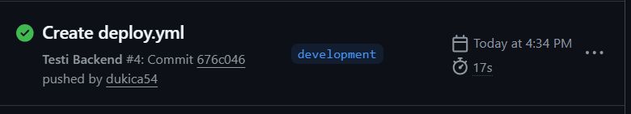


---


### 2.5 Workflow — Kotlin server (produkcijska veja)
*Avtor*


Kotlin workflow je enak backend workflowu. Posebnost: Gradle mora ob prvem buildu prenesti vse odvisnosti (~200 MB) kar traja **5–10 minut**. To je normalno — GitHub Actions runner nima predpomnjenega Gradle cache-a. Ob naslednjih buildih je enako počasen ker Docker vsakič začne od začetka v čistem okolju. Optimizacija bi bila dodati `actions/cache` za `.gradle` mapo — za to nalogo ni zahtevano.


```yaml
name: CI/CD Kotlin Server

on:
  push:
    branches: [ main, master ]

jobs:
  build-and-push:
    runs-on: ubuntu-latest
    steps:
      - uses: actions/checkout@v4

      - name: Login to Docker Hub
        uses: docker/login-action@v3
        with:
          username: ${{ secrets.DOCKERHUB_USERNAME }}
          password: ${{ secrets.DOCKERHUB_TOKEN }}

      - name: Build and push
        uses: docker/build-push-action@v5
        with:
          context: .
          push: true
          tags: ${{ secrets.DOCKERHUB_USERNAME }}/dropinslovenia_kotlin-server:latest

  notify-server:
    runs-on: ubuntu-latest
    needs: build-and-push
    steps:
      - name: Webhook na VM
        uses: distributhor/workflow-webhook@v3
        with:
          webhook_url: http://${{ secrets.VM_HOST }}:9000/hooks/deploy-kotlin
          webhook_secret: ${{ secrets.WEBHOOK_SECRET }}
          data: '{"service": "kotlin-server"}'
```


*Slika: GitHub Actions — uspešen kotlin workflow run*
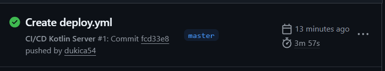


---


---


## 3. Webhook


### 3.1 Namestitev webhook strežnika
*Avtor*


**Kaj je `webhook` paket?** `webhook` je majhen HTTP strežnik napisan v Go ki posluša na določenem portu (pri nas 9000). Ko dobi HTTP zahtevo na `/hooks/<id>`, preveri pogoje (pri nas HMAC podpis) in zažene nastavljeno skripto. Je lahek, zanesljiv in enostaven za konfigurirati.


**Zakaj ne pišemo lastnega webhook strežnika?** Bi lahko — v Node.js ali Python — ampak `webhook` paket je že preizkušena rešitev ki pravilno implementira varnostno preverjanje. Pisanje lastnega bi pomenilo tudi pisanje HMAC preverjanja, kar je bolj kompleksno in bolj ranljivo za napake.


```bash
# Na VM
sudo apt install webhook -y


# Preverimo verzijo
webhook --version
```


---


### 3.2 Deploy skripta
*Avtor*


**Logika skripte:** Skripta sprejme ime servisa (`frontend`, `backend` ali `kotlin-server`) kot argument `$1`. `case` stavek določi ustrezno Docker sliko, ime containerja in port mapping. Nato:
1. Ustavi stari container (`docker stop`) — `2>/dev/null` tišimo napake v primeru da container sploh ne teče
2. Odstrani stari container (`docker rm`) — container mora biti odstranjen preden zaženemo novega z istim imenom
3. Prenese novo sliko z Docker Hub (`docker pull`) — vedno potegne `latest` tag, ki je bil ravno posodobljen z GitHub Actions
4. Zažene nov container z `--restart unless-stopped` — ostane po rebootu VM
5. Vse korake zapiše v `/var/log/deploy.log` z datumom in uro za sledenje


**Zakaj `--env-file` in ne direktno spremenljivke?** `.env` datoteka na VM vsebuje MongoDB URI, JWT secret itd. Z `--env-file` te spremenljivke naložimo v container brez da bi jih pisali v skripto (kjer bi bile vidne v logih ali v kodi).


Datoteka: `/opt/deploy/deploy.sh`


```bash
#!/bin/bash
# Deploy skripta — zažene se ob vsakem webhook klicu
# Argument $1: ime servisa (frontend, backend, kotlin-server)


SERVICE=$1
DOCKERHUB_USER="dukica"
ENV_FILE="/home/dropInSloveniaVM/dropinslovenia/.env"
LOG_FILE="/var/log/deploy.log"


echo "========================================" >> $LOG_FILE
echo "[$(date)] Deploy zahtevano za: $SERVICE" >> $LOG_FILE


# Določimo parametre glede na servis
case $SERVICE in
  "frontend")
    IMAGE="$DOCKERHUB_USER/dropinslovenia_frontend:latest"
    CONTAINER="frontend"
    PORT_MAPPING="3001:3001"
    ;;
  "backend")
    IMAGE="$DOCKERHUB_USER/dropinslovenia_backend:latest"
    CONTAINER="backend"
    PORT_MAPPING="3000:3000"
    ;;
  "kotlin-server")
    IMAGE="$DOCKERHUB_USER/dropinslovenia_kotlin-server:latest"
    CONTAINER="kotlin-server"
    PORT_MAPPING="8080:8080"
    ;;
  *)
    echo "[$(date)] NAPAKA: Neznan servis '$SERVICE'" >> $LOG_FILE
    exit 1
    ;;
esac


# Ustavimo in odstranimo stari container
# 2>/dev/null: ne prikazuj napak če container ne obstaja (ob prvem deployu)
echo "[$(date)] Ustavljam stari container: $CONTAINER" >> $LOG_FILE
docker stop $CONTAINER 2>/dev/null || echo "[$(date)] Container ni tekel" >> $LOG_FILE
docker rm $CONTAINER 2>/dev/null || echo "[$(date)] Container ni obstajal" >> $LOG_FILE


# Potegnemo najnovejšo sliko z Docker Hub
echo "[$(date)] Prenašam novo sliko: $IMAGE" >> $LOG_FILE
docker pull $IMAGE


# Zaženemo nov container
echo "[$(date)] Zaganjam nov container: $CONTAINER" >> $LOG_FILE
docker run -d \
  --name $CONTAINER \
  -p $PORT_MAPPING \
  --env-file $ENV_FILE \
  --restart unless-stopped \
  $IMAGE


echo "[$(date)] Deploy uspešno zaključen: $SERVICE" >> $LOG_FILE
```


**Namestitev na VM:**
```bash
# Ustvarimo mapo in datoteko
sudo mkdir -p /opt/deploy
sudo nano /opt/deploy/deploy.sh
# (prilepimo vsebino zgoraj)


# Naredimo skripto izvršljivo
sudo chmod +x /opt/deploy/deploy.sh


# Ustvarimo log datoteko z ustreznimi pravicami
sudo touch /var/log/deploy.log
sudo chmod 666 /var/log/deploy.log


# Ročni test skripte (preden testiramo cel pipeline)
/opt/deploy/deploy.sh backend
# Počakaj ~30 sekund
docker ps
# Mora prikazati backend container z svežim CREATED časom
cat /var/log/deploy.log
# Mora prikazati deploy loge
```


📸 *Slika: Ročni test skripte — terminal z outputom in `docker ps` po zagonu*


---


### 3.3 Webhook konfiguracija in systemd servis
*Luka Manfreda*

**Datoteka `/etc/webhook/hooks.json`:**

```json
[
  {
    "id": "deploy-frontend",
    "execute-command": "/opt/deploy/deploy.sh",
    "command-working-directory": "/home/dropInSloveniaVM/dropinslovenia",
    "pass-arguments-to-command": [
      { "source": "payload", "name": "data.service" }
    ],
    "trigger-rule": {
      "match": {
        "type": "payload-hmac-sha256",
        "secret": "*********",
        "parameter": {
          "source": "header",
          "name": "X-Hub-Signature-256"
        }
      }
    }
  },
  {
    "id": "deploy-backend",
    "execute-command": "/opt/deploy/deploy.sh",
    "command-working-directory": "/home/dropInSloveniaVM/dropinslovenia",
    "pass-arguments-to-command": [
      { "source": "payload", "name": "data.service" }
    ],
    "trigger-rule": {
      "match": {
        "type": "payload-hmac-sha256",
        "secret": "******",
        "parameter": {
          "source": "header",
          "name": "X-Hub-Signature-256"
        }
      }
    }
  },
  {
    "id": "deploy-kotlin",
    "execute-command": "/opt/deploy/deploy.sh",
    "command-working-directory": "/home/dropInSloveniaVM/dropinslovenia",
    "pass-arguments-to-command": [
      { "source": "payload", "name": "data.service" }
    ],
    "trigger-rule": {
      "match": {
        "type": "payload-hmac-sha256",
        "secret": "************",
        "parameter": {
          "source": "header",
          "name": "X-Hub-Signature-256"
        }
      }
    }
  }
]
```


**Datoteka `/etc/systemd/system/webhook.service`:**


```ini
[Unit]
Description=Webhook Server za DropInSlovenia deploy
After=network.target docker.service
# After: zaženi webhook šele ko je omrežje in Docker pripravljeno


[Service]
User=dropInSloveniaVM
ExecStart=/usr/bin/webhook -hooks /etc/webhook/hooks.json -port 9000 -verbose
# -verbose: izpisuje loge vsakega klica — koristno za debugging
Restart=always
RestartSec=5
StandardOutput=journal
StandardError=journal
# journal: logi gredo v systemd journal (berljivo z: journalctl -u webhook)


[Install]
WantedBy=multi-user.target
```

*Slika: `systemctl status webhook` — active (running)*
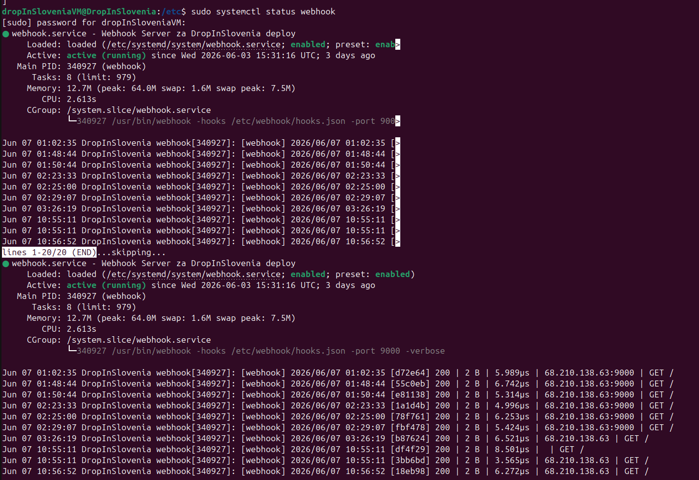
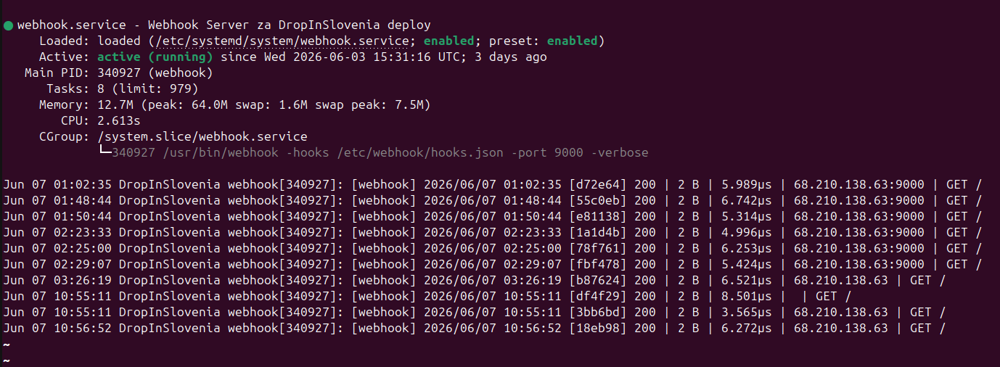
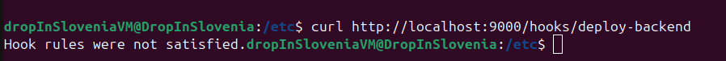


---


---

## 4. Varnost pri Webhookih
*Avtor*


### 4.1 Identificirane varnostne luknje


**Luknja 1: Webhook URL je javno dostopen brez avtentikacije**
> Kdorkoli ki pozna IP in port 9000 lahko pošlje HTTP zahtevo. Brez zaščite bi napadalec s primerno zahtevo sprožil deploy kadarkoli — kar bi povzročilo restart servisov ali naložitev zlonamerne slike.
*Rešitev:* HMAC-SHA256 podpis — GitHub podpiše vsak request s secretom, webhook strežnik podpis preveri preden zažene skripto. Brez veljavnega podpisa se skripta ne izvede. **Že implementirano v `hooks.json`.**


**Luknja 2: HTTP namesto HTTPS**
> Webhook komunikacija poteka po nešifriranem HTTP. Napadalec na omrežju med GitHub in VM (man-in-the-middle) bi videl vsebino zahtev. Čeprav je payload podpisan z HMAC (kar ščiti pred manipulacijo), bi napadalec videl kdaj in za kateri servis se sprožijo deployi — koristna informacija za načrtovanje napada.
*Rešitev:* Dodati TLS certifikat prek nginx reverse proxy in Let's Encrypt (`certbot`). Za to nalogo ni zahtevano, je pa priporočljivo v produkciji.


**Luknja 3: Deploy skripta teče s pravicami `azureuser` ki ima dostop do `.env`**
> Skripta bere `/home/azureuser/.env` ki vsebuje MongoDB URI in JWT secret. Napadalec ki bi uspešno sprožil webhook bi izvedel skripto ki dostopa do vseh teh skrivnosti. Prav tako ima `azureuser` dostop do Dockerja — s privileji Dockerja je mogoče eskalirati na root.
*Rešitev:* Ločen `deployer` user z minimalnimi pravicami:
```bash
sudo useradd -r -s /bin/bash deployer
sudo usermod -aG docker deployer
# Webhook servis poženemo kot 'deployer' — spremenimo User= v webhook.service
```


**Luknja 4: Webhook secret je v `hooks.json` v čistem tekstu**
> Vsakdo z SSH dostopom do VM (vsi 3 člani) vidi secret. Hkrati je datoteka berljiva z `sudo cat` brez posebnih pravic.
*Rešitev:* Branje secreta iz environment spremenljivke:
```bash
# V /etc/systemd/system/webhook.service dodamo:
Environment=WEBHOOK_SECRET=vrednost_iz_openssl
# V hooks.json pa spremenimo:
# "secret": "${WEBHOOK_SECRET}"
# Tako se secret ne shranjuje v nobeni konfiguraciji datoteki
```


---


### 4.2 Implementirane varnostne rešitve


**HMAC-SHA256 podpis (implementirano v hooks.json):**


HMAC (Hash-based Message Authentication Code) deluje takole:
1. GitHub Actions zna naš `WEBHOOK_SECRET`
2. Ob vsakem webhook klicu GitHub izračuna SHA-256 hash payload-a XOR z secretom
3. Ta podpis doda v `X-Hub-Signature-256` HTTP header
4. Webhook strežnik na VM izračuna isti podpis in ga primerja
5. Če se podpisa ujemata → zahteva je legitimna, skripta se zažene
6. Če se ne ujemata → zahteva se zavrne, skripta se NE zažene


Brez poznavanja secreta je nemogoče ustvariti veljaven podpis — napad je matematično nemogoč.


**UFW Firewall — omejitev porta 9000 samo na GitHub IP naslove (implementirano):**


```bash
# Najprej preverimo da je UFW nameščen
sudo apt install ufw -y


# Najprej dovolimo SSH (da se ne zaključimo sami ven!)
sudo ufw allow 22
sudo ufw allow 3000
sudo ufw allow 3001
sudo ufw allow 8080


# Zapri port 9000 za vse
sudo ufw deny 9000


# Dovoli samo GitHub Actions IP range
# (IP naslovi ki jih GitHub Actions runners dejansko uporabljajo)
sudo ufw allow from 140.82.112.0/20 to any port 9000
sudo ufw allow from 185.199.108.0/22 to any port 9000
sudo ufw allow from 192.30.252.0/22 to any port 9000


# Aktiviraj UFW
sudo ufw --force enable


# Preveri pravila
sudo ufw status verbose
```


> **Opomba:** GitHub IP naslovi se občasno spremenijo. Aktualni seznam je vedno na https://api.github.com/meta pod `actions` ključem. Ob morebitnih problemih s webhookom v prihodnosti preveri ali so IP-ji še veljavni.


📸 *Slika: `sudo ufw status` z vidnimi firewall pravili*
`[VSTAVI SLIKO TUKAJ]`


---

